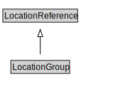

# LocationGroup

<a href="../../diagrams/itsLocation__LocationGroup.dot.svg">Open interactive LocationGroup diagram</a>

## Specializations of LocationGroup

| Class | Description |
|-------|-------------|
| [Location Group By List](itsLocation__LocationGroupByList.md) |  |

## Formalization for LocationGroup

| Property | Constraint |
|----------|------------|
| subClassOf | LocationReference |

## Other annotations

| Annotation | Value |
|------------|-------|
| xsd::pattern | LocationPattern |

