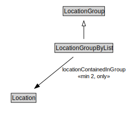

# LocationGroupByList

<a href="../../diagrams/itsLocation__LocationGroupByList.dot.svg">Open interactive LocationGroupByList diagram</a>

## Formalization for LocationGroupByList

| Property | Constraint |
|----------|------------|
| locationContainedInGroup | all Location |
| locationContainedInGroup | min 2 owl::Thing |
| subClassOf | LocationGroup |

## Other annotations

| Annotation | Value |
|------------|-------|
| xsd::pattern | LocationPattern |

