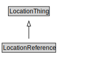

# LocationReference

<a href="../../diagrams/itsLocation__LocationReference.dot.svg">Open interactive LocationReference diagram</a>

## Specializations of LocationReference

| Class | Description |
|-------|-------------|
| [Area Location](itsLocation__AreaLocation.md) |  |
| [Indexed Location](itsLocation__IndexedLocation.md) |  |
| [Itinerary](itsLocation__Itinerary.md) |  |
| [Itinerary By Indexed Locations](itsLocation__ItineraryByIndexedLocations.md) |  |
| [Linear Location](itsLocation__LinearLocation.md) |  |
| [Location](itsLocation__Location.md) |  |
| [Location Group](itsLocation__LocationGroup.md) |  |
| [Location Group By List](itsLocation__LocationGroupByList.md) |  |
| [Network Location](itsLocation__NetworkLocation.md) |  |
| [Point Location](itsLocation__PointLocation.md) |  |

## Formalization for LocationReference

| Property | Constraint |
|----------|------------|
| subClassOf | LocationThing |

## Other annotations

| Annotation | Value |
|------------|-------|
| xsd::pattern | LocationPattern |

