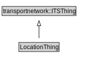

# LocationThing

<a href="../../diagrams/itsLocation__LocationThing.dot.svg">Open interactive LocationThing diagram</a>

## Specializations of LocationThing

| Class | Description |
|-------|-------------|
| [Area Destination](itsLocation__AreaDestination.md) |  |
| [Area Location](itsLocation__AreaLocation.md) |  |
| [Destination](itsLocation__Destination.md) |  |
| [Indexed Location](itsLocation__IndexedLocation.md) |  |
| [Itinerary](itsLocation__Itinerary.md) |  |
| [Itinerary By Indexed Locations](itsLocation__ItineraryByIndexedLocations.md) |  |
| [Jurisdictional Entity](itsLocation__JurisdictionalEntity.md) |  |
| [Linear Location](itsLocation__LinearLocation.md) |  |
| [Location](itsLocation__Location.md) |  |
| [Location Group](itsLocation__LocationGroup.md) |  |
| [Location Group By List](itsLocation__LocationGroupByList.md) |  |
| [Location Reference (itsLocation)](itsLocation__LocationReference.md) |  |
| [Named Area](itsLocation__NamedArea.md) |  |
| [Network Location](itsLocation__NetworkLocation.md) |  |
| [Point Coordinates](itsLocation__PointCoordinates.md) |  |
| [Point Destination](itsLocation__PointDestination.md) |  |
| [Point Location](itsLocation__PointLocation.md) |  |
| [Position Confidence Ellipse](itsLocation__PositionConfidenceEllipse.md) |  |
| [Supplementary Positional Description](itsLocation__SupplementaryPositionalDescription.md) |  |

## Formalization for LocationThing

| Property | Constraint |
|----------|------------|
| subClassOf | transportnetwork::ITSThing |

## Other annotations

| Annotation | Value |
|------------|-------|
| xsd::pattern | LocationPattern |

