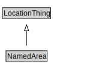

# NamedArea

<a href="../../diagrams/itsLocation__NamedArea.dot.svg">Open interactive NamedArea diagram</a>

## Formalization for NamedArea

| Property | Constraint |
|----------|------------|
| subClassOf | LocationThing |

## Other annotations

| Annotation | Value |
|------------|-------|
| xsd::pattern | LocationPattern |

