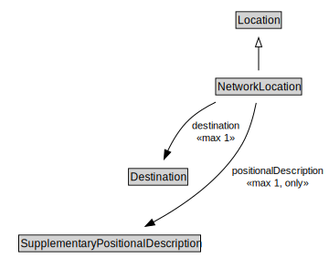

# NetworkLocation

<a href="../../diagrams/itsLocation__NetworkLocation.dot.svg">Open interactive NetworkLocation diagram</a>

## Specializations of NetworkLocation

| Class | Description |
|-------|-------------|
| [Linear Location](itsLocation__LinearLocation.md) |  |
| [Point Location](itsLocation__PointLocation.md) |  |

## Formalization for NetworkLocation

| Property | Constraint |
|----------|------------|
| destination | max 1 owl::Thing |
| positionalDescription | all SupplementaryPositionalDescription |
| positionalDescription | max 1 owl::Thing |
| subClassOf | Location |

## Other annotations

| Annotation | Value |
|------------|-------|
| xsd::pattern | LocationPattern |

