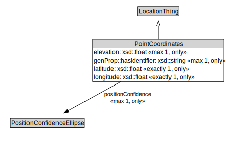

# PointCoordinates

<a href="../../diagrams/itsLocation__PointCoordinates.dot.svg">Open interactive PointCoordinates diagram</a>

## Formalization for PointCoordinates

| Property | Constraint |
|----------|------------|
| elevation | all xsd::float |
| elevation | max 1 owl::Thing |
| genProp::hasIdentifier | all xsd::string |
| genProp::hasIdentifier | max 1 owl::Thing |
| latitude | all xsd::float |
| latitude | exactly 1 owl::Thing |
| longitude | all xsd::float |
| longitude | exactly 1 owl::Thing |
| positionConfidence | all PositionConfidenceEllipse |
| positionConfidence | max 1 owl::Thing |
| subClassOf | LocationThing |

## Used by classes

| Class | Property |
|-------|----------|
| [Location](itsLocation__Location.md) | coordinatesForDisplay |

## Other annotations

| Annotation | Value |
|------------|-------|
| xsd::pattern | LocationPattern |

