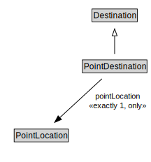

# PointDestination

<a href="../../diagrams/itsLocation__PointDestination.dot.svg">Open interactive PointDestination diagram</a>

## Formalization for PointDestination

| Property | Constraint |
|----------|------------|
| pointLocation | all PointLocation |
| pointLocation | exactly 1 owl::Thing |
| subClassOf | Destination |

## Other annotations

| Annotation | Value |
|------------|-------|
| xsd::pattern | LocationPattern |

