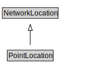

# PointLocation

<a href="../../diagrams/itsLocation__PointLocation.dot.svg">Open interactive PointLocation diagram</a>

## Formalization for PointLocation

| Property | Constraint |
|----------|------------|
| subClassOf | NetworkLocation |

## Used by classes

| Class | Property |
|-------|----------|
| [Point Destination](itsLocation__PointDestination.md) | pointLocation |

## Other annotations

| Annotation | Value |
|------------|-------|
| xsd::pattern | LocationPattern |

