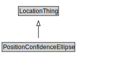

# PositionConfidenceEllipse

<a href="../../diagrams/itsLocation__PositionConfidenceEllipse.dot.svg">Open interactive PositionConfidenceEllipse diagram</a>

## Formalization for PositionConfidenceEllipse

| Property | Constraint |
|----------|------------|
| subClassOf | LocationThing |

## Used by classes

| Class | Property |
|-------|----------|
| [Point Coordinates](itsLocation__PointCoordinates.md) | positionConfidence |

## Other annotations

| Annotation | Value |
|------------|-------|
| xsd::pattern | LocationPattern |

