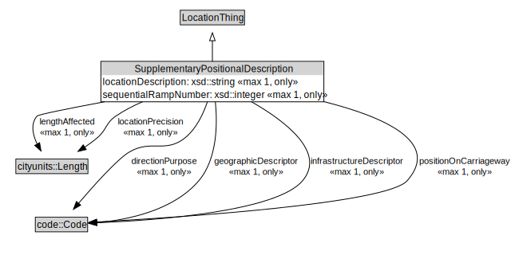

# SupplementaryPositionalDescription

<a href="../../diagrams/itsLocation__SupplementaryPositionalDescription.dot.svg">Open interactive SupplementaryPositionalDescription diagram</a>

## Formalization for SupplementaryPositionalDescription

| Property | Constraint |
|----------|------------|
| directionPurpose | all code::Code |
| directionPurpose | max 1 owl::Thing |
| geographicDescriptor | all code::Code |
| geographicDescriptor | max 1 owl::Thing |
| infrastructureDescriptor | all code::Code |
| infrastructureDescriptor | max 1 owl::Thing |
| lengthAffected | all cityunits::Length |
| lengthAffected | max 1 owl::Thing |
| locationDescription | all xsd::string |
| locationDescription | max 1 owl::Thing |
| locationPrecision | all cityunits::Length |
| locationPrecision | max 1 owl::Thing |
| positionOnCarriageway | all code::Code |
| positionOnCarriageway | max 1 owl::Thing |
| sequentialRampNumber | all xsd::integer |
| sequentialRampNumber | max 1 owl::Thing |
| subClassOf | LocationThing |

## Used by classes

| Class | Property |
|-------|----------|
| [Network Location](itsLocation__NetworkLocation.md) | positionalDescription |

## Other annotations

| Annotation | Value |
|------------|-------|
| xsd::pattern | LocationPattern |

